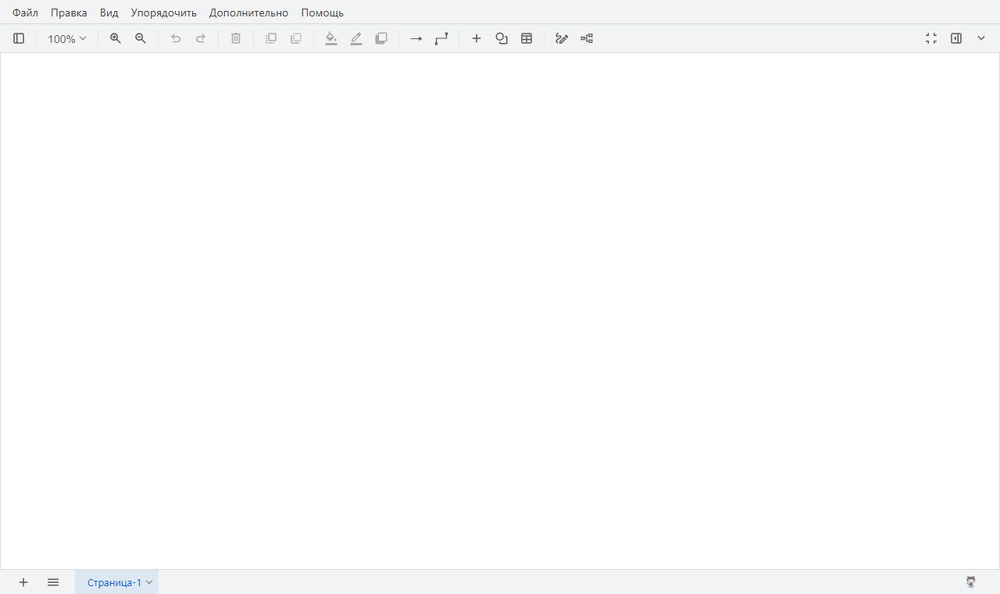

<div align="center">

# drawio-sql-er

**SQL → ER-диаграмма прямо в draw.io**

PostgreSQL · MySQL · SQLite · живая база PostgreSQL

[](https://github.com/valeragav/drawio-sql-er/actions/workflows/check.yml)
[](LICENSE)
[](https://nodejs.org)
[](https://www.drawio.com/)

[Установка и настройка](docs/setup.md) · [Руководство](docs/guide.md) · [Изменения](CHANGELOG.md)



</div>

Вставьте `CREATE TABLE …`, выберите файл `.sql` или подключитесь к базе PostgreSQL — и
получите аккуратную схему: каждая таблица — блок со строками-колонками, связи идут от поля
к полю в нотации «воронья лапка». Диаграмма — обычные фигуры draw.io: их можно двигать,
править и сохранять как всё остальное.

> Это небольшой личный проект. Он развивается по мере возможностей: новые функции и
> диалекты SQL будут добавляться постепенно. Идеи и сообщения об ошибках — в
> [Issues](https://github.com/valeragav/drawio-sql-er/issues).

## Возможности

| | |
| --- | --- |
| 📋 **Всё из SQL** | колонки, типы и ограничения как в SQL (`NOT NULL`, `DEFAULT …`, `CHECK (…)`), первичные и внешние ключи, индексы, ENUM, представления, комментарии |
| 🗄️ **Из живой базы** | подключение к PostgreSQL только на чтение; пароль нигде не сохраняется |
| 🧭 **Раскладка** | связи раскладываются так, чтобы меньше пересекаться, и идут в обход таблиц |
| 🗂️ **Большие схемы** | рамки-группы по префиксам имён или схемам, компактный режим, выбор таблиц |
| 🔄 **Обновление** | диаграмма обновляется из новой версии схемы, таблицы остаются на своих местах |
| 🔍 **Сравнение** | отчёт о расхождениях диаграммы и базы с подсветкой на схеме |
| 📤 **Экспорт** | обратно в SQL (с вашими правками) и в Mermaid для Markdown |

## Быстрый старт

**Docker** — draw.io с плагином в браузере:

```sh
git clone https://github.com/valeragav/drawio-sql-er.git
cd drawio-sql-er
docker compose up -d        # → http://localhost:8080
```

**draw.io Desktop** (нужен Node.js 22.9+):

```sh
npm install
npm start                   # терминал не закрывать, пока работаете
```

**Без установки** — на [app.diagrams.net](https://app.diagrams.net/) плагин вставляется в
консоль браузера ([инструкция](docs/setup.md#сайт-appdiagramsnet)). Подключения к базе
там нет.

Затем: **Упорядочить → Вставить → «Из SQL (ER-диаграмма)…»**, вставьте SQL (например,
[`examples/shop.sql`](examples/shop.sql)) и нажмите **«Вставить»**.

Подробности, сравнение способов, `.env` и подключение к базе описаны в
[установке и настройке](docs/setup.md), работа с окном и командами — в
[руководстве](docs/guide.md).

## Документация

- [**Установка и настройка**](docs/setup.md): Docker, draw.io Desktop, сайт, сервер без
  Docker, `.env`, подключение к базе, безопасность, обновление.
- [**Руководство**](docs/guide.md): окно вставки, как читать диаграмму, команды (обновить,
  сравнить, подсветка, экспорт), что понимается из SQL, вопросы и проблемы, ограничения.

## Разработка

```sh
npm run build   # собрать dist/sql-er-plugin.js
npm test
npm run check   # перед выпуском: сборка актуальна, тесты проходят
```

Устройство проекта и соглашения описаны в [CLAUDE.md](CLAUDE.md), изменения — в
[CHANGELOG.md](CHANGELOG.md).

## Лицензия

[MIT](LICENSE)
