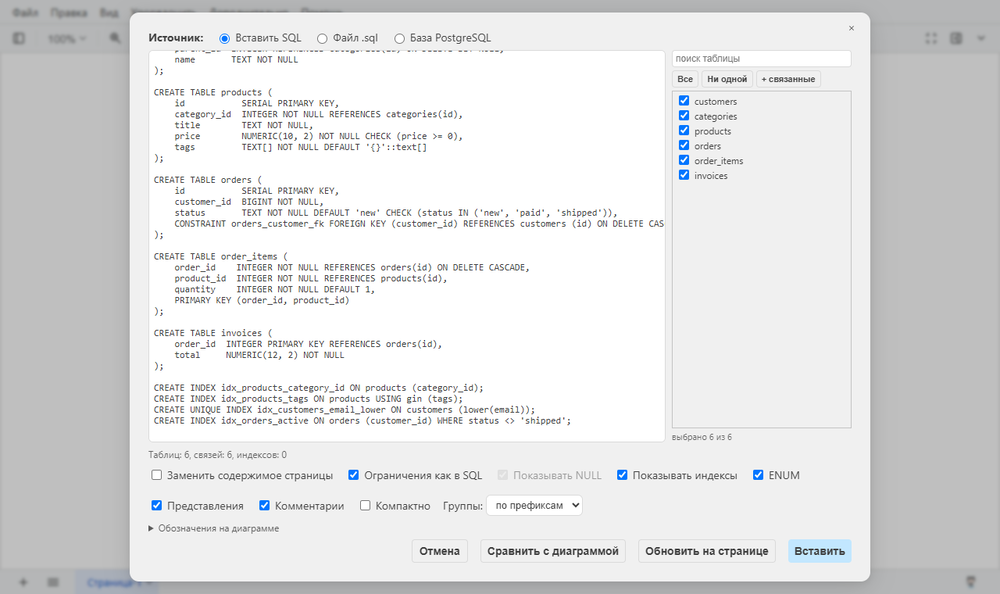
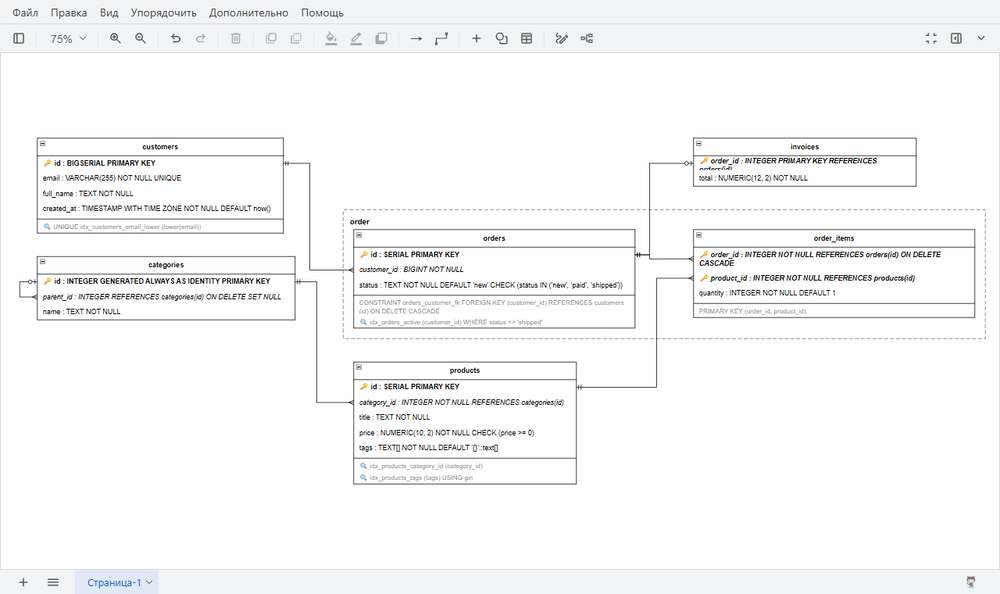
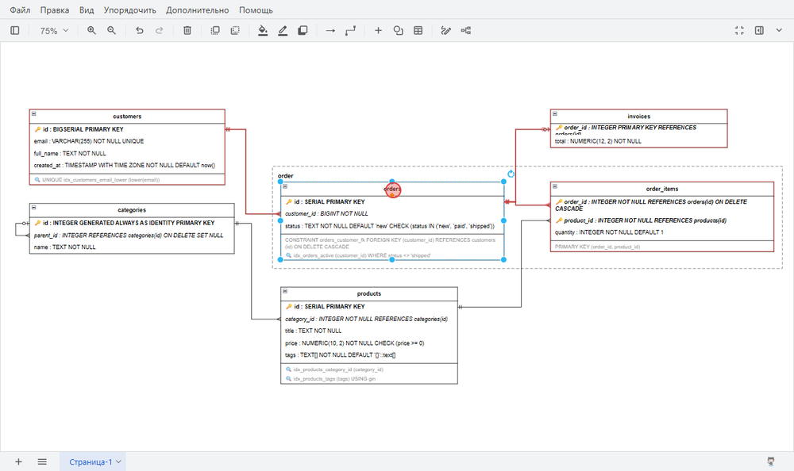
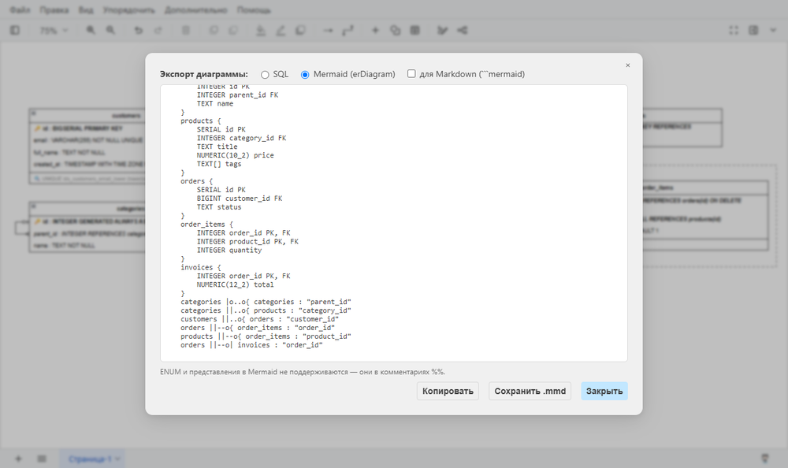

# Руководство

[← README](../README.md) · [Установка и настройка](setup.md) · **Руководство**

- [Вставка диаграммы](#вставка-диаграммы)
- [Как читать диаграмму](#как-читать-диаграмму)
- [Команды](#команды)
- [Что понимается из SQL](#что-понимается-из-sql)
- [Вопросы и проблемы](#вопросы-и-проблемы)
- [Ограничения](#ограничения)

## Вставка диаграммы

Меню **Упорядочить → Вставить → «Из SQL (ER-диаграмма)…»** (в английском интерфейсе
*Arrange → Insert*). Пункт находится в меню «Упорядочить», а не в верхнем меню «Вставка».



### 1. Источник

- **Вставить SQL**: вставьте текст в поле.
- **Файл .sql**: нажмите «Выбрать файл…» или перетащите файл в поле.
- **База PostgreSQL**: строка подключения, пароль, схемы, затем «Подключиться»
  (см. [«Подключение к базе»](setup.md#подключение-к-базе)).

При любом источнике SQL оказывается в поле, и его можно поправить перед вставкой. Под полем
видно, сколько найдено таблиц, связей и индексов, а также предупреждения.

Для пробы подойдут примеры из папки [`examples/`](../examples): `shop.sql` — маленькая
схема, `ecommerce.sql` — побольше, `mysql.sql` и `sqlite.sql` — другие диалекты.

### 2. Таблицы

Справа — список таблиц с галочками: поиск по имени, «Все» / «Ни одной», «+ связанные»
(добавить соседей отмеченных таблиц). Вставляются только отмеченные таблицы. Ссылки на
остальные остаются в строках колонок (`REFERENCES …`), но без линий.

### 3. Настройки

| Настройка                        | Что делает                                                                                   |
| -------------------------------- | -------------------------------------------------------------------------------------------- |
| **Заменить содержимое страницы** | очищает страницу перед вставкой; без неё диаграмма встанет под уже нарисованным               |
| **Ограничения как в SQL**        | после типа показывается всё, что написано у колонки; без неё — короткие метки `PK`, `FK`, `UQ`, `AI` |
| **Показывать NULL**              | в режиме коротких меток помечает колонки без `NOT NULL`                                      |
| **Показывать индексы**, **ENUM**, **Представления**, **Комментарии** | что показывать на диаграмме                                 |
| **Компактно**                    | в таблицах только ключи и колонки со связями, остальные свёрнуты в строку «⋯ ещё N колонок» (список — во всплывающей подсказке) |
| **Группы**                       | рамки вокруг таблиц: *по префиксам* (`course_modules`, `course_lessons`, `courses` → «course»), *по схемам* (`billing.*`) или *нет* |

Внизу окна — раскрывающаяся легенда **«Обозначения на диаграмме»**.

### 4. Вставить

Диаграмма появится на странице. Вставка отменяется одним Ctrl+Z.



## Как читать диаграмму

| Обозначение                         | Значение                                                          |
| ----------------------------------- | ----------------------------------------------------------------- |
| 🔑 и **жирный**                     | первичный ключ                                                    |
| *курсив*                            | внешний ключ                                                      |
| 💬                                  | у колонки есть комментарий (наведите мышь)                        |
| 🔍                                  | индекс                                                            |
| строки под разделителем             | ограничения таблицы (`PRIMARY KEY (a, b)`, `CHECK (…)`) и индексы |
| `\|\|`                              | обязательная связь                                                |
| `\|o`                               | необязательная связь (внешний ключ допускает `NULL`)              |
| «воронья лапка»                     | один ко многим                                                    |
| `\|o` на стороне ребёнка            | один к одному                                                     |
| тонкий пунктир рядом с основной линией | остальные пары колонок составного внешнего ключа               |
| блок `«enum» имя`                   | ENUM со значениями; пунктир ведёт к колонкам этого типа           |
| блок с пунктирной рамкой            | представление (VIEW); стрелки — от таблиц, из которых оно читает  |
| дуга на пересечении линий           | «мостик»: линии не соединены                                      |

## Команды

Все команды находятся в меню **Упорядочить**, каждая отменяется одним Ctrl+Z.

### Обновить на странице

Кнопка в окне вставки. Если схема изменилась, загрузите новый SQL и нажмите «Обновить на
странице» вместо «Вставить»:

- таблицы остаются на своих местах и сохраняют ваши правки стиля, у них обновляются колонки,
  ограничения и индексы;
- новые таблицы встают рядом со связанными и выделяются;
- таблицы, которых больше нет в схеме, не удаляются, а становятся пунктирными и
  полупрозрачными — удалите их сами, если они не нужны;
- связи прокладываются заново.

Подпись таблицы можно переименовать — таблица всё равно узнаётся.

### Сравнить с диаграммой

Кнопка в окне вставки. Загрузите схему (лучше из базы), и отчёт покажет, чем от неё
отличается диаграмма на странице: таблицы, колонки, типы, `NOT NULL`, `DEFAULT`, ключи,
индексы, ENUM, представления, а по галочке — ещё и комментарии.

Сравнивается смысл, а не запись: `INT` = `integer`, `SERIAL` = `integer DEFAULT nextval(…)`.
Различия временно подсвечиваются на диаграмме: красным — расходящиеся, зелёным — таблицы,
которых в схеме нет. Из окна отчёта можно сразу обновить диаграмму.

### Подсветка связей (SQL ER)

Выделите таблицу, и её связи и соседние таблицы обведутся красным. Обводка временная и
диаграмму не меняет. Пункт меню включает и выключает подсветку.



### Экспорт в SQL / Mermaid (SQL ER)…

Собирает SQL из того, что нарисовано на странице, вместе с вашими правками:
переименованными таблицами, исправленными или добавленными строками, связями, нарисованными
вручную между строками двух таблиц (такая связь станет `FOREIGN KEY`).

Формат **Mermaid** нужен для вставки схемы в Markdown: GitHub и GitLab её рисуют. Галочка
«для Markdown» оборачивает текст в блок ```` ```mermaid ````. Результат можно скопировать или
сохранить в файл.



### Перепроложить связи (SQL ER)

Если вы передвинули таблицы, линии проложатся заново по новым местам, рамки групп тоже
подстроятся. Таблицы не должны накладываться друг на друга.

## Что понимается из SQL

**PostgreSQL:** `CREATE TABLE`, `ALTER TABLE … ADD …`, `CREATE INDEX`,
`CREATE TYPE … AS ENUM`, `ALTER TYPE … ADD VALUE`, `CREATE [MATERIALIZED] VIEW`,
`COMMENT ON …`. Вывод `pg_dump --schema-only` читается целиком. Поддерживаются схемы,
`"имена в кавычках"`, любые типы, `SERIAL`, `GENERATED … AS IDENTITY`.

**MySQL и SQLite** распознаются автоматически: `` `имена` `` и `[имена]`, `AUTO_INCREMENT`,
`COMMENT '…'`, `KEY` / `UNIQUE KEY` / `FULLTEXT KEY`, `ENGINE=…`, `WITHOUT ROWID`, дамп
`mysqldump`.

**Комментарии** берутся из `COMMENT ON`, а также из `--`: в конце строки колонки или
строками прямо над колонкой или над `CREATE …`. Заголовки разделов, отделённые пустой
строкой, не считаются комментариями.

Всё остальное (функции, триггеры, `INSERT`, `GRANT` …) пропускается.

## Вопросы и проблемы

**В меню нет пункта «Из SQL (ER-диаграмма)…».**
Он находится в *Упорядочить → Вставить* (*Arrange → Insert*), а не в верхнем меню «Вставка».
- Desktop: draw.io должен быть запущен через `npm start`, а терминал — открыт. Если draw.io
  был открыт раньше обычным способом, закройте его и повторите.
- Docker: обновите страницу с очисткой кэша (Ctrl+F5).
- Сайт: плагин пропадает после перезагрузки вкладки, вставьте его в консоль заново.

**Кнопка «Подключиться» неактивна.**
Подключение к базе работает только в Docker и в draw.io, запущенном через `npm start`
(терминал должен быть открыт). На app.diagrams.net его нет.

**«Сервер не отвечает» или «Превышено время ожидания».**
Проверьте хост и порт. В Docker вместо `localhost` нужен `host.docker.internal`. Проверьте,
что PostgreSQL принимает подключения не только с `localhost` (`listen_addresses`,
`pg_hba.conf`).

**«Неверный пользователь или пароль», «База данных не найдена», «Доступ запрещён
(pg_hba.conf)».**
Ошибка в строке подключения или в настройках доступа PostgreSQL.

**`npm start`: «draw.io Desktop не найден».**
Установите обычную версию (`winget install JGraph.Draw`) или укажите путь в `DRAWIO_EXE`.
Версия из Microsoft Store не подходит.

**`npm start`: «Нужен Node.js 22.9 или новее».**
Обновите Node.js с https://nodejs.org.

**Порт 8080 занят.**
Поменяйте `SQL_ER_PORT` в `.env` и выполните `docker compose up -d`.

**Линии легли криво после того, как я подвинул таблицы.**
*Упорядочить → Перепроложить связи (SQL ER)*.

## Ограничения

- Подключение к базе — только PostgreSQL.
- У представлений из SQL-файла нет типов колонок (их знает только база).
- Составные типы (`CREATE TYPE … AS (…)`), домены, функции и триггеры не показываются.
- `--`-комментарии есть только в тексте SQL; из базы берутся только `COMMENT ON`.
- Экспорт в SQL выдаёт синтаксис PostgreSQL, в том числе для схем из MySQL и SQLite.
- «Обновить на странице» работает только для диаграмм, вставленных этим плагином.
- В Docker нет офлайн-режима draw.io; PDF сохраняется через печать браузера.
